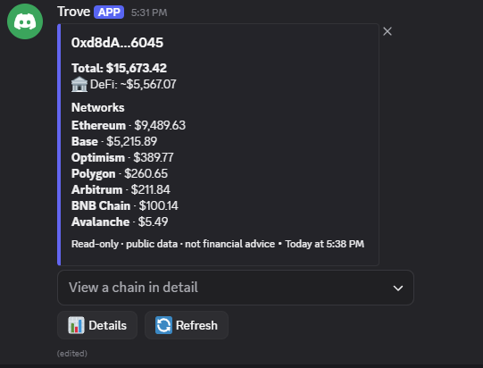
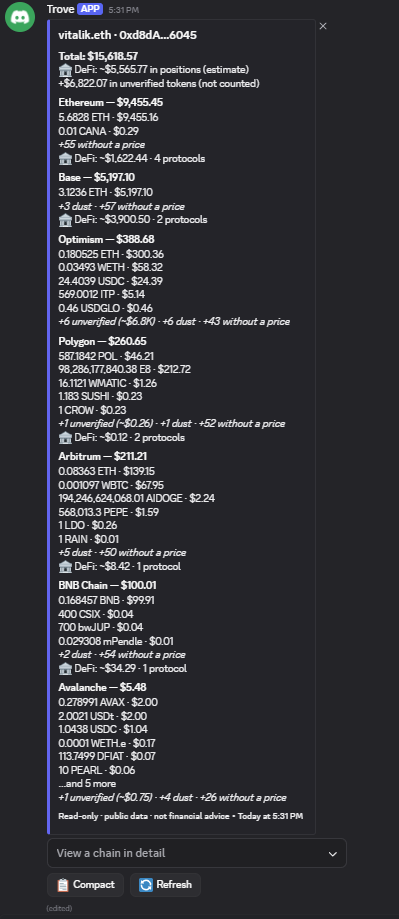
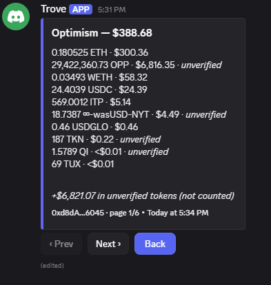

<div align="center">

# Trove

### A free, open-source Discord bot that shows any wallet's full on-chain portfolio

Type `/wallet <address>` and Trove replies with the wallet's holdings across many chains —
native coins, tokens, and DeFi positions — in one tidy message. Read-only. No keys. No accounts.


</div>

---

## What it is

Trove is a Discord bot you can self-host for free. When someone types `/wallet` with a wallet
address or ENS name, Trove looks up that wallet across many chains and posts a clean summary: how
much it holds, on which chains, in which coins and tokens, and what it has in DeFi protocols.

It is meant for communities that would otherwise paste addresses into a block explorer and squint at
raw numbers. Trove does the gathering, pricing, and tidying for them — right inside Discord.

It is strictly **read-only**. Trove only ever reads _public_ addresses and _public_ market data. It
never asks for a private key or seed phrase and has no ability to move funds of any kind.

> There is no public Trove bot to invite — you run your own. It takes about 10 minutes; see
> [Self-hosting](#-self-hosting).

## A few terms, explained

If you are new to this, these are the only words you need:

| Term               | Meaning                                                                                                                 |
| ------------------ | ----------------------------------------------------------------------------------------------------------------------- |
| **Wallet address** | A _public_ identifier for a wallet — like an account number that is safe to share. Never a secret password.             |
| **ENS name**       | A human-friendly alias for an Ethereum address, such as `vitalik.eth`.                                                  |
| **Chain**          | A blockchain network, e.g. Ethereum, Bitcoin, or Solana.                                                                |
| **Token**          | A coin that lives _on_ a chain (for example USDC on Ethereum).                                                          |
| **DeFi position**  | Value parked in a protocol — lending on Aave, a liquidity pool on Uniswap, staking, and so on (shown as an _estimate_). |
| **Unverified**     | A priced token that isn't on a reputable list (often airdrop spam). Shown separately, **never** in the total.           |
| **Dust**           | A real holding worth less than a cent. Counted in the total but collapsed into a "+N dust" note.                        |
| **Self-host**      | Running the bot yourself on your own computer or server, so nobody else controls it.                                    |

## ✨ Features

- **Many networks at once.** Ethereum, Base, Arbitrum, Optimism, Polygon, BNB Chain and Avalanche,
  **plus Bitcoin, Litecoin, Dogecoin, Bitcoin Cash, Solana and TRON** (TRX, TRC-20 incl. USDT, and
  staked TRX) — from one command.
- **Honest totals.** The headline value counts only assets that are both **priced** and **verified**
  against a reputable token list. Airdrop spam — worthless tokens with a fake price — is shown
  separately and **never inflates the total**.
- **DeFi positions.** Lending, liquidity pools, staking and vaults are surfaced per protocol with
  estimated USD values.
- **Compact or detailed.** Replies open in a clean, compact view (total + one line per chain); a
  **Details** button expands the full per-chain breakdown for anyone who wants it.
- **Interactive.** A menu lets you drill into any chain for the full holdings list, with **Prev /
  Next** pagination and a **Refresh** button. Long, spam-heavy wallets stay readable.
- **Watchlists & combined portfolio.** Each user can save addresses with `/watchlist` and see their
  combined value with `/portfolio`.
- **Multiple data providers with automatic fail-over.** Alchemy, Covalent and Moralis are all
  supported. If one provider is down or doesn't cover a chain, Trove transparently tries the next.
- **Safe by design.** Read-only, public data only, never asks for keys, cannot move funds.

## 📸 Screenshots

| Compact view (the default)                           | Detailed view (tap **📊 Details**)            |
| ---------------------------------------------------- | --------------------------------------------- |
|  |  |

<div align="center">

_Drill into any chain — the full holdings list with Prev / Next pagination_



</div>

## 💬 Commands

| Command                        | What it does                                                                                                                                                                |
| ------------------------------ | --------------------------------------------------------------------------------------------------------------------------------------------------------------------------- |
| `/wallet <address>`            | Show a wallet's portfolio. Accepts an **EVM address or ENS name**, a **Bitcoin / Litecoin / Dogecoin / Bitcoin Cash address**, a **Solana address**, or a **TRON address**. |
| `/watchlist add\|remove\|list` | Save wallet addresses to track (private to each user).                                                                                                                      |
| `/portfolio`                   | The combined value of every wallet on your watchlist.                                                                                                                       |
| `/help`                        | List the commands and how to use them.                                                                                                                                      |
| `/about`                       | The project, its privacy model, and the source link.                                                                                                                        |

### Using a wallet reply

- **Try it:** `/wallet vitalik.eth` (ENS), or paste any address — for example:
  - EVM: `0xd8dA6BF26964aF9D7eEd9e03E53415D37aA96045`
  - Bitcoin: `1A1zP1eP5QGefi2DMPTfTL5SLmv7DivfNa`
  - Solana / TRON: any `…`/`T…` address.
- The reply opens **compact** (total + one line per chain). Tap **📊 Details** to expand each chain's
  top holdings; tap **📋 Compact** to collapse again.
- Use the **drop-down menu** under the reply to open one chain and see its full holdings list.
- **‹ Prev / Next ›** page through a long list (10 per page); **Back** returns to the summary;
  **🔄 Refresh** re-fetches (results are cached ~90 s, so numbers may not change every time).
- **Watchlist:** `/watchlist add address:<addr> label:<optional name>`,
  `/watchlist remove address:<addr>` (use the address/ENS, **not** the label), `/watchlist list`.
  Your list is private to you.
- **Portfolio:** save wallets with `/watchlist add`, then run `/portfolio` for their combined value.
- **Cooldowns:** `/wallet` every ~5 s, `/portfolio` every ~15 s per person — a "Please wait Ns"
  message is normal, not an error.

## 🚀 Self-hosting

There is no hosted Trove — you run your own. It takes about 10 minutes and costs nothing.

### Before you start

You need a few free things. If you already have them, skip ahead.

1. **Node.js 20 or newer** (we test on 22). This also installs `npm`.
   - **Windows / macOS:** download the **LTS** installer from <https://nodejs.org> and run it (keep
     all the defaults — this adds `node` and `npm` to your system).
   - **macOS (Homebrew):** `brew install node`
   - **Any OS (recommended if you tinker):** install [nvm](https://github.com/nvm-sh/nvm), then
     `nvm install 22 && nvm use 22`.
   - **Verify:** open a **new** terminal and run `node -v` (should print `v20` or higher) and
     `npm -v`. If either says "not recognized" / "command not found", reinstall and reopen the
     terminal.
2. **Git** — only for the `git clone` path below. No git? Use the **Download ZIP** option instead.
   (Windows: <https://git-scm.com/download/win>; macOS: `brew install git`.)
3. **A Discord account** with the **Manage Server** permission on the server you'll add the bot to.

> **What's a terminal?** A window where you type commands. On **Windows**, the easiest way to get one
> _inside the project folder_: open the `trove` folder in File Explorer, click the **address bar**,
> type `powershell`, and press **Enter**. On **macOS/Linux**, open Terminal and `cd` into the folder.

### Step 1 — Create a Discord bot

1. Open the **[Discord Developer Portal](https://discord.com/developers/applications)** → **New
   Application**, give it a name.
2. **Bot** tab → **Reset Token** → **copy the token immediately** — it is shown only once (missed it?
   just Reset again). This is your `DISCORD_TOKEN`. Trove uses only slash commands, so you do **NOT**
   need any **Privileged Gateway Intents** — leave Message Content / Server Members **off**.
3. **General Information** → copy the **Application ID**. This is your `DISCORD_CLIENT_ID`.
   ⚠️ The token and the Application ID are **different** values — swapping them is the #1 startup
   error.
4. Invite the bot: **OAuth2 → URL Generator**, tick **`bot`** and **`applications.commands`**. In the
   **Bot Permissions** panel you can leave everything unticked (Trove only replies with messages), or
   tick just **Send Messages** + **Embed Links**. If an **Integration Type** dropdown appears, choose
   **Guild Install**. Copy the URL at the bottom, open it, pick your server (you need **Manage
   Server** there), and click **Authorize**.

### Step 2 — Get a data provider key (free)

You need **at least one** of these (all have free tiers). **If you just want it working:** sign up at
**Alchemy**, create an **App**, and copy its **API Key** into `ALCHEMY_KEY` — that alone covers all
EVM chains **and** ENS (so `/wallet vitalik.eth` works). Add **Moralis** later if you want **Solana**
or **DeFi positions** (both require Moralis specifically). **Bitcoin, Litecoin, Dogecoin, Bitcoin
Cash and TRON need no key at all.**

| Provider                | Sign up                         | Where the key is                   | Covers                        |
| ----------------------- | ------------------------------- | ---------------------------------- | ----------------------------- |
| **Alchemy**             | <https://dashboard.alchemy.com> | Create an App → **API Key**        | EVM balances **+ ENS**        |
| **Covalent (GoldRush)** | <https://goldrush.dev>          | Dashboard → **API Keys** (`cqt_…`) | The widest list of EVM chains |
| **Moralis**             | <https://admin.moralis.com>     | **Web3 APIs → API Keys**           | EVM, **Solana**, **DeFi**     |

### Step 3 — Get the code, configure, and run

**Get the code — pick one:**

- **Easiest (no git):** on the GitHub page click the green **Code → Download ZIP**, then right-click
  the file → **Extract All**, and note where the `trove` folder lands.
- **With git:** `git clone https://github.com/YOUR-USERNAME/trove.git` then `cd trove`

**Install dependencies** (from a terminal _inside_ the `trove` folder):

```
npm install
```

**Create your config file** (copy the template):

- macOS/Linux: `cp .env.example .env`
- Windows PowerShell: `Copy-Item .env.example .env`
- Windows CMD: `copy .env.example .env`

Then open the new **`.env`** file in a text editor (Windows: right-click → **Open with → Notepad**)
and fill in the values from Steps 1–2, one per line. _(A filename that starts with a dot and has no
extension — `.env` — is normal and intentional.)_

**Register the slash commands, then start the bot:**

```
npm run register
npm start
```

When the console prints **`Trove is online`**, the bot is live — type `/wallet vitalik.eth` in your
server. `npm start` keeps running: **leave this terminal open and your PC awake** for the bot to stay
online; press **Ctrl + C** to stop it. You only need `npm run register` again when the commands
change. _(For 24/7 unattended hosting, use Docker below.)_

> **Tip — instant commands while testing.** Set `DEV_GUILD_ID` in `.env` to your server's ID and
> commands appear within seconds (left empty, global registration can take up to ~1 hour). To get the
> ID: Discord → **User Settings → Advanced → Developer Mode (on)**, then right-click your server icon
> → **Copy Server ID**.

### Run with Docker (optional, for 24/7 hosting)

Requires **Docker Desktop** (<https://docs.docker.com/get-docker/>) installed and **running**, and
uses the Compose v2 plugin (`docker compose`). First get the code and create your `.env` (Step 3),
then from the `trove` folder:

```
docker compose run --rm trove npm run register   # one-time: register slash commands
docker compose up --build -d                      # run the bot in the background
```

The container reads `.env` and persists watchlists to `./data`. It only **runs** the bot — re-run the
`register` line whenever the commands change.

## 🩺 Troubleshooting

| What you see                                                               | What it means / how to fix                                                                                                                                            |
| -------------------------------------------------------------------------- | --------------------------------------------------------------------------------------------------------------------------------------------------------------------- |
| `'node'`, `'npm'`, or `'git' is not recognized` / `command not found`      | Not installed, or the terminal was open before you installed it. Install from [Before you start](#before-you-start), then **close and reopen** the terminal.          |
| `node -v` shows v18 or lower                                               | Too old. Install Node **20+**.                                                                                                                                        |
| `Invalid environment configuration: - DISCORD_TOKEN is required …` (exits) | A required value in `.env` is blank. Make sure you ran the copy step and filled in `DISCORD_TOKEN` and `DISCORD_CLIENT_ID`.                                           |
| `An invalid token was provided` / never prints `Trove is online`           | `DISCORD_TOKEN` is wrong or expired. Re-copy it from **Bot → Reset Token** (not the Application ID, which goes in `DISCORD_CLIENT_ID`).                               |
| Bot is online but `/` commands don't appear                                | (a) Did you run `npm run register`? (b) Set `DEV_GUILD_ID` for instant commands — global takes up to ~1 h. (c) Re-invite with both `bot` and `applications.commands`. |
| _"This bot has no data provider configured yet…"_                          | You started with no provider key. Add one of `ALCHEMY_KEY` / `COVALENT_KEY` / `MORALIS_KEY` (Step 2) to `.env` and restart.                                           |
| `/wallet vitalik.eth` → _"ENS names need an Ethereum mainnet RPC…"_        | ENS needs `ALCHEMY_KEY` or `MAINNET_RPC_URL`. With only Covalent/Moralis, look up a plain `0x…` address instead.                                                      |
| _"That doesn't look like a valid address…"_                                | Typo, missing character, or stray spaces. Trove supports `0x…`, BTC/LTC/DOGE/BCH, Solana, TRON addresses, and `.eth` names.                                           |
| _"Some chains could not be loaded; this view may be incomplete"_           | A provider failed or was rate-limited for that chain. Press **🔄 Refresh**, or add a second provider key for fail-over.                                               |
| Solana or DeFi positions are empty                                         | Both require the **Moralis** key specifically. Set `MORALIS_KEY` and restart.                                                                                         |
| `'docker' is not recognized` / `Cannot connect to the Docker daemon`       | Install and **start** Docker Desktop, then retry.                                                                                                                     |

## ⚙️ Configuration

All configuration lives in `.env` (copied from `.env.example`). The environment is validated on
startup, so a missing or malformed value fails fast with a readable message.

| Variable            | Required     | Purpose                                                                |
| ------------------- | ------------ | ---------------------------------------------------------------------- |
| `DISCORD_TOKEN`     | ✅           | Your bot's token (Bot tab)                                             |
| `DISCORD_CLIENT_ID` | ✅           | Your Application ID (General Information)                              |
| `DEV_GUILD_ID`      | —            | A server ID for instant command registration while developing          |
| `ALCHEMY_KEY`       | one of these | EVM balances + ENS                                                     |
| `COVALENT_KEY`      | one of these | EVM balances across many chains                                        |
| `MORALIS_KEY`       | one of these | EVM balances, DeFi positions, Solana                                   |
| `TRONGRID_KEY`      | —            | Optional TronGrid key (TRON works keyless; a key lifts the rate limit) |
| `MAINNET_RPC_URL`   | —            | Ethereum RPC for ENS (falls back to `ALCHEMY_KEY`)                     |
| `DEFAULT_CHAINS`    | —            | EVM chains queried for an EVM address                                  |
| `DATA_DIR`          | —            | Where watchlists are stored (default `./data`)                         |
| `CACHE_TTL_SECONDS` | —            | How long a result is cached before a refresh re-fetches                |
| `LOG_LEVEL`         | —            | `fatal` … `trace`                                                      |

## 🔒 Privacy & safety

- **Read-only.** Trove reads public addresses and public market data only. It never sends a wallet's
  holdings anywhere and cannot move funds.
- **No keys, ever.** It does not ask for — and cannot use — a private key or seed phrase.
- **Your secrets stay local.** API keys live in `.env`, which is git-ignored and never committed.
- **No telemetry.** The bot makes no outbound calls except to the data providers it needs.

## 🛠️ How it works

Trove keeps a strict separation between a pure, framework-free **core** (data model, providers,
aggregation, pricing, verification — all unit-tested without the network) and a thin **Discord
layer** (slash commands, embeds, interactive components).

```
src/
  config/         Environment + the chain registry (single source of truth)
  core/
    models/       Normalized portfolio types
    providers/    One folder per provider (alchemy, covalent, moralis, utxo, solana, tron) + a router
    prices/       DefiLlama price client (batched, keyless)
    verify/       Token verification against reputable token lists
    aggregator/   Per-chain fetch with fail-over, pricing, classification, totals
    ens/          Address validation + ENS resolution + ecosystem detection
    cache/        In-memory TTL cache
    storage/      Watchlist persistence (a dependency-free JSON store)
  discord/        Client, commands (wallet, watchlist, portfolio…), embeds, components
```

A few deliberate design choices:

- **Provider abstraction + router.** Every provider implements one small interface. A router picks,
  per chain, the configured providers in preference order and falls through on failure.
- **Honest valuation.** Totals include only verified, priced assets. Unverified-but-priced tokens
  (airdrop spam) and DeFi are disclosed separately, so the number you see is one you can trust.
- **Pricing is keyless.** Prices come from DefiLlama's batched endpoint; providers' own prices are
  kept and only the gaps are filled.

For the full design, see [`docs/ARCHITECTURE.md`](docs/ARCHITECTURE.md).

## 🧑‍💻 Development

```
npm run dev          # run with auto-reload
npm run typecheck    # tsc --noEmit (strict)
npm run lint         # eslint
npm test             # vitest (network-free unit tests)
npm run format       # prettier --write
```

The test suite covers the provider mappers, the aggregator's verified/unverified logic, the provider
router, pricing/normalization, ecosystem detection, the watchlist store, and the interactive
component state — all without touching the network. Contributions are welcome; see
[`CONTRIBUTING.md`](CONTRIBUTING.md).

## Disclaimer

Trove is a tool for tracking and education. It is **not financial advice**. Market and on-chain data
come from third-party providers and may be delayed or inaccurate. Always do your own research.

## License

Trove is free and open source under the [MIT License](LICENSE).
